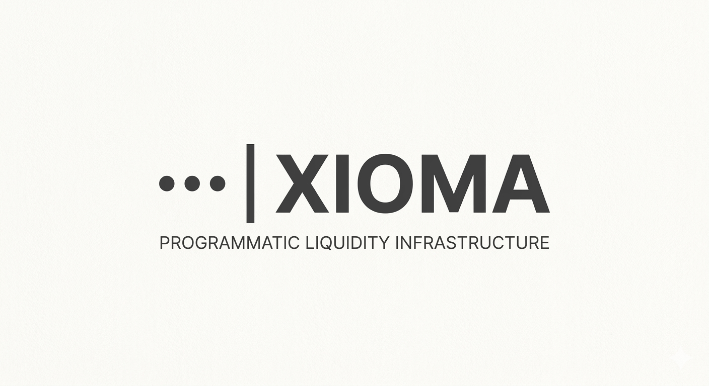
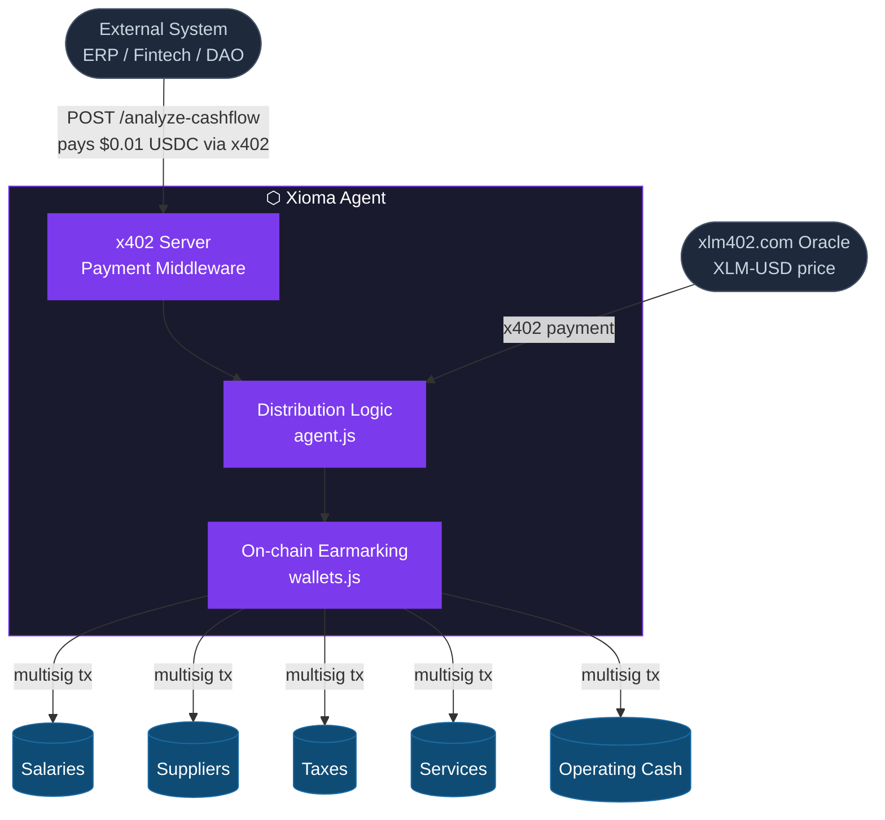
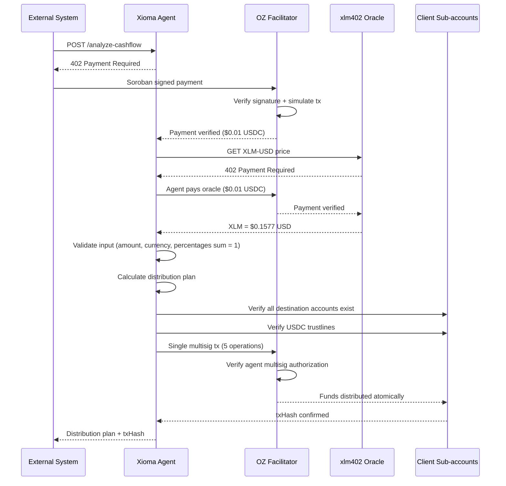
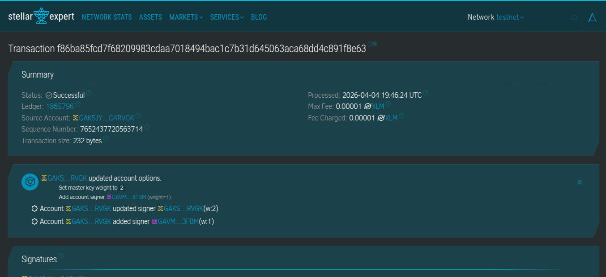
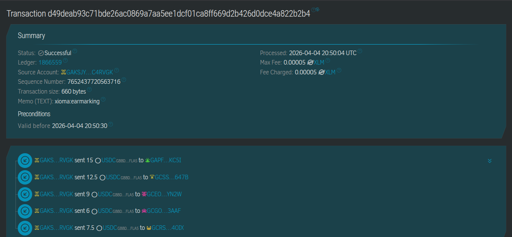
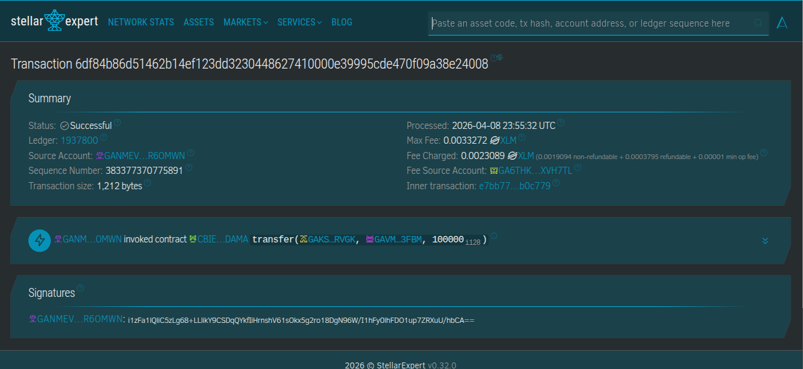
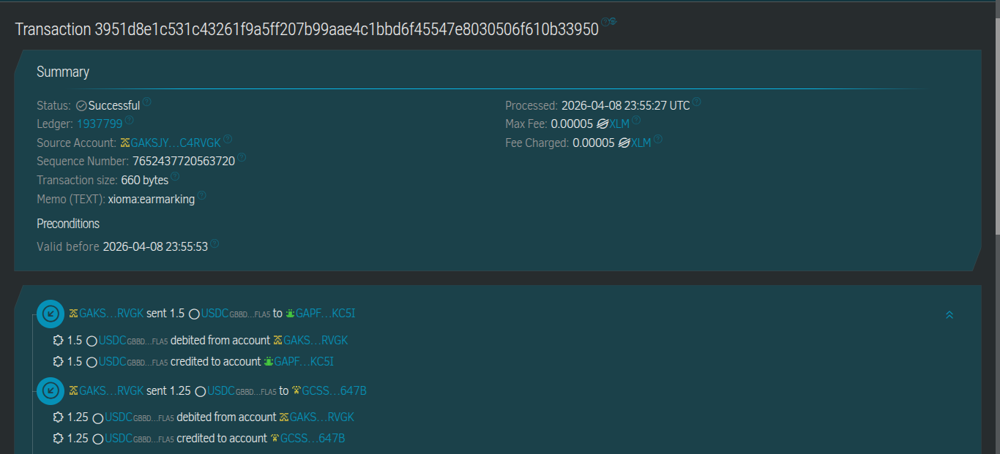
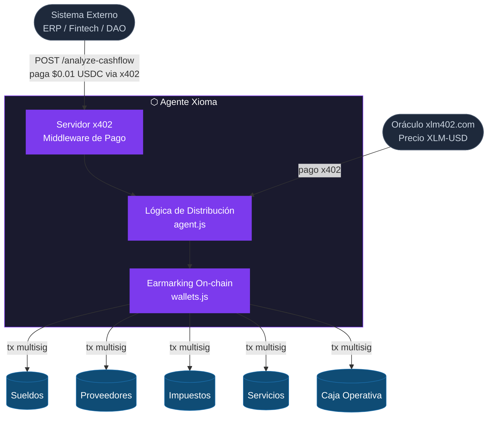
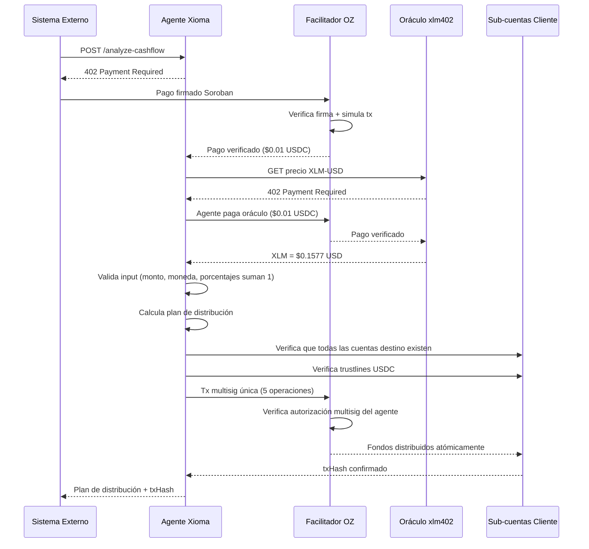

# Xioma — Programmatic Liquidity Infrastructure

🇺🇸 [English](#english) · 🇦🇷 [Español](#español)

---

<a name="english"></a>
## 🇺🇸 English

### What is Xioma?

Xioma is an autonomous cash flow agent built on Stellar that works alongside accounting systems and ERPs to help businesses meet their financial obligations. When a payment is received, Xioma automatically distributes the funds into on-chain reserved sub-accounts for salaries, suppliers, taxes, services, and operating cash.

The agent exposes a pay-per-request HTTP endpoint using the x402 protocol. Any system can call it, pay in USDC on Stellar, and receive back a distribution plan with the earmarking already executed on-chain.

**The core insight: Xioma doesn't just use x402 — Xioma is x402.**

---

### The Problem It Solves

Companies receive payments but consistently fail to reserve funds for future obligations. This is not a lack of information — it is human bias. Available money gets spent on immediate needs, and when payroll, tax deadlines, or supplier payments arrive, liquidity is gone.

Web2 cannot solve this. Bank reserves are purely accounting entries — anyone with access can override them at any time.

Blockchain enables programmatic, verifiable reserves. Xioma uses Stellar to create on-chain earmarks that cannot be touched impulsively. A supplier can verify their payment is reserved without depending on anyone's word.

**Primary use case**: Financial service providers — accounting firms, payroll processors, fintechs — that want to offer intelligent fund distribution to their SME clients without building the infrastructure from scratch.

---

### Architecture



Xioma operates in a dual role:
- **As an x402 server**: charges clients per request in USDC before executing distribution logic
- **As an x402 client**: pays for external data (XLM-USD price from xlm402.com oracle) before calculating distributions

---

### Key Technical Decisions

**1. Multisig instead of custody**

The agent never holds client funds. The client configures their Stellar account once, adding the agent as a secondary signer with weight 1. The client retains their key at weight 2 and can revoke agent access at any time.

This means: the agent signs transactions from the client's account without ever receiving the client's private key. No temporary custody, no key exposure.

**2. Single multi-operation transaction**

All five earmarking transfers execute in a single Stellar transaction with multiple operations. This means:
- One fee covers all operations
- Atomic execution — either all transfers succeed or none do
- No partial state possible

**3. Client-owned sub-accounts**

Destination sub-accounts belong to the client, not the agent. The agent only executes transfers — it does not control the destination accounts.

**4. Input validation before any on-chain action**

All distribution parameters are validated before any Stellar transaction is built:
- Amount must be positive and below maximum threshold
- Currency must be USDC
- Obligation percentages must sum to exactly 1.0 (with floating point tolerance)
- All destination accounts must exist and be reachable

---

### How It Works — Request Flow


---

### Project Structure

```
xioma-agent/
├── src/
│   ├── server.js       x402 server — payment middleware + endpoint handler
│   ├── agent.js        distribution logic — pure function, no side effects
│   ├── wallets.js      on-chain earmarking via multisig
│   └── client.js       demo client — x402 payment flow + oracle query
├── demo/
│   └── simulate.js     end-to-end demo script
├── .env.example        environment variable template
└── README.md
```

---

### Tech Stack

| Component | Technology |
|---|---|
| Runtime | Node.js v20+ (ES Modules) |
| Server framework | Express.js |
| x402 server middleware | `@x402/express` |
| x402 client | `@x402/fetch` |
| Stellar/x402 utilities | `@x402/stellar`, `@x402/core` |
| Stellar SDK | `@stellar/stellar-sdk` |
| Facilitator | OpenZeppelin testnet (`channels.openzeppelin.com/x402/testnet`) |
| Network | `stellar:testnet` |
| Oracle | xlm402.com — XLM-USD price via x402 |

---

### How to Run

**Prerequisites**
- Node.js v20+
- Two funded Stellar testnet accounts (agent + client) with USDC trustlines
- OpenZeppelin API key: https://channels.openzeppelin.com/testnet/gen
- Five client sub-accounts with USDC trustlines (one per obligation category)
- Client account configured with agent as secondary multisig signer

**Setup**

```bash
git clone https://github.com/ange-r/xioma-agent
cd xioma-agent
npm install
cp .env.example .env
# Edit .env with your keys and addresses
```

**Environment variables**

```env
AGENT_PRIVATE_KEY=S...
AGENT_PUBLIC_KEY=G...
CLIENT_PRIVATE_KEY=S...
CLIENT_PUBLIC_KEY=G...
OZ_API_KEY=your_openzeppelin_api_key
NETWORK=stellar:testnet
STELLAR_RPC_URL=https://soroban-testnet.stellar.org
USDC_CONTRACT_ID=C...
WALLET_SALARIES=G...
WALLET_SUPPLIERS=G...
WALLET_TAXES=G...
WALLET_SERVICES=G...
WALLET_OPERATING_CASH=G...
```

**Run**

Terminal 1 — start the agent server:
```bash
node src/server.js
```

Terminal 2 — run the demo client:
```bash
node src/client.js
```

---

### Verified Testnet Transactions

**Multisig configuration**


**First earmarking — 5 sub-accounts in one transaction**


**Oracle x402 payment**


**Full flow with oracle**

---

### Known Limitations

- Distribution parameters (categories, percentages, destination addresses) must be provided by the calling system in each request. Xioma trusts these parameters — validation of business logic is the responsibility of the accounting system.
- The XLM-USD price from the oracle is logged but not yet used in distribution calculations. In production this would be used for currency conversion before earmarking.
- No persistent storage — client configurations are not saved between requests.
- Testnet only — mainnet deployment would require production key management (vault), updated facilitator URL, and a formal client onboarding flow.

---

### Next Steps

- Currency conversion using oracle data before distribution (XLM → USDC via Stellar DEX swap)
- Client configuration registry — store obligation profiles so the calling system only needs to send the incoming amount
- Trustless Work escrow integration for supplier payment release on delivery confirmation
- SDK for easy integration with existing accounting systems (Contagram, Tango Gestión, Odoo)
- Mainnet deployment with proper key management

---

### Resources

- [x402 on Stellar — Docs](https://developers.stellar.org/docs/build/apps/x402)
- [x402-stellar repo](https://github.com/stellar/x402-stellar)
- [OpenZeppelin facilitator](https://channels.openzeppelin.com/x402/testnet)
- [xlm402.com — x402 service catalogue](https://xlm402.com)
- [Stellar SDK](https://developers.stellar.org/docs/tools/sdks)
- [Trustless Work](https://www.trustlesswork.com)

---

<a name="español"></a>
## 🇦🇷 Español

### ¿Qué es Xioma?

Xioma es un agente autónomo de cash flow construido sobre Stellar que trabaja junto a sistemas contables y ERPs para ayudar a empresas a cumplir sus obligaciones financieras. Cuando entra una cobranza, Xioma distribuye automáticamente los fondos en sub-cuentas reservadas on-chain para sueldos, proveedores, impuestos, servicios y caja operativa.

El agente expone un endpoint HTTP de pago por uso usando el protocolo x402. Cualquier sistema puede llamarlo, pagar en USDC sobre Stellar, y recibir como respuesta un plan de distribución con el earmarking ya ejecutado on-chain.

**La idea central: Xioma no solo usa x402 — Xioma es x402.**

---

### El problema que resuelve

Las empresas reciben cobranzas pero no reservan para las obligaciones futuras. No es falta de información — es sesgo humano. El dinero disponible se gasta en lo inmediato, y cuando llegan los vencimientos de sueldos, impuestos o proveedores, la liquidez no está.

Web2 no lo resuelve. Las reservas bancarias son solo contables — cualquiera con acceso puede disponer de esos fondos en cualquier momento.

Blockchain permite reservas programáticas y verificables. Xioma usa Stellar para crear earmarks on-chain que no se pueden gastar por impulso. Un proveedor puede confirmar que su pago está reservado sin depender de la palabra de nadie.

**Caso de uso primario**: prestadores de servicios financieros — estudios contables, procesadoras de nómina, fintechs — que quieran ofrecer distribución inteligente de fondos a sus clientes PyME sin construir esa infraestructura desde cero.

---

### Arquitectura



Xioma opera en rol dual:
- **Como servidor x402**: cobra por request en USDC antes de ejecutar la lógica de distribución
- **Como cliente x402**: paga por datos externos (precio XLM-USD del oráculo xlm402.com) antes de calcular distribuciones

---

### Decisiones técnicas clave

**1. Multisig en lugar de custodia**

El agente nunca toca los fondos del cliente. El cliente configura su cuenta Stellar una sola vez, agregando al agente como firmante secundario con peso 1. El cliente mantiene su clave con peso 2 y puede revocar el acceso al agente en cualquier momento.

Esto significa: el agente firma transacciones desde la cuenta del cliente sin recibir su clave privada. Sin custodia temporal, sin exposición de claves.

**2. Una sola transacción multioperation**

Las cinco transferencias de earmarking se ejecutan en una sola transacción Stellar con múltiples operaciones:
- Un fee cubre todas las operaciones
- Ejecución atómica — o todo sale o nada sale
- Sin estado parcial posible

**3. Sub-cuentas del cliente**

Las sub-cuentas destino pertenecen al cliente, no al agente. El agente solo ejecuta transferencias — no controla las cuentas destino.

**4. Validación antes de cualquier acción on-chain**

Todos los parámetros de distribución se validan antes de construir cualquier transacción Stellar:
- El monto debe ser positivo y estar dentro del límite máximo
- La moneda debe ser USDC
- Los porcentajes de obligaciones deben sumar exactamente 1.0
- Todas las cuentas destino deben existir y ser alcanzables

---

### Flujo de una request


---

### Estructura del proyecto

```
xioma-agent/
├── src/
│   ├── server.js       servidor x402 — middleware de pago + handler del endpoint
│   ├── agent.js        lógica de distribución — función pura, sin efectos secundarios
│   ├── wallets.js      earmarking on-chain via multisig
│   └── client.js       cliente de demo — flujo de pago x402 + consulta al oráculo
├── demo/
│   └── simulate.js     script de demo end-to-end
├── .env.example        template de variables de entorno
└── README.md
```

---

### Cómo correrlo

**Prerequisitos**
- Node.js v20+
- Dos cuentas Stellar testnet fondeadas (agente + cliente) con trustlines USDC
- API key de OpenZeppelin: https://channels.openzeppelin.com/testnet/gen
- Cinco sub-cuentas del cliente con trustlines USDC (una por categoría de obligación)
- Cuenta del cliente configurada con el agente como firmante multisig secundario

**Setup**

```bash
git clone https://github.com/ange-r/xioma-agent
cd xioma-agent
npm install
cp .env.example .env
# Editá .env con tus claves y direcciones
```

**Correr**

Terminal 1 — servidor del agente:
```bash
node src/server.js
```

Terminal 2 — cliente de demo:
```bash
node src/client.js
```

---

### Transacciones verificables en testnet

**Configuración multisig**


**Primer earmarking — 5 sub-cuentas en una sola transacción**


**Pago x402 al oráculo**


**Flujo completo con oráculo**


### Limitaciones conocidas

- Los parámetros de distribución (categorías, porcentajes, direcciones destino) deben ser provistos por el sistema que llama en cada request. Xioma confía en esos parámetros — la validación de la lógica de negocio es responsabilidad del sistema contable.
- El precio XLM-USD del oráculo se loguea pero todavía no se usa en los cálculos de distribución. En producción se usaría para conversión de moneda antes del earmarking.
- Sin persistencia — las configuraciones de clientes no se guardan entre requests.
- Solo testnet — el despliegue en mainnet requeriría gestión de claves en producción (vault), URL del facilitador actualizada, y un flujo formal de onboarding de clientes.

---

### Próximos pasos

- Conversión de moneda usando datos del oráculo antes de la distribución (XLM → USDC via swap en el SDEX de Stellar)
- Registro de configuración de clientes — guardar perfiles de obligaciones para que el sistema contable solo mande el monto de la cobranza
- Integración con Trustless Work escrow para liberación de pagos a proveedores al confirmar entrega
- SDK para integración con sistemas contables existentes (Contagram, Tango Gestión, Odoo)
- Despliegue en mainnet con gestión apropiada de claves

---

### Recursos

- [x402 en Stellar — Docs](https://developers.stellar.org/docs/build/apps/x402)
- [Repo x402-stellar](https://github.com/stellar/x402-stellar)
- [Facilitador OpenZeppelin](https://channels.openzeppelin.com/x402/testnet)
- [xlm402.com — catálogo de servicios x402](https://xlm402.com)
- [SDK de Stellar](https://developers.stellar.org/docs/tools/sdks)
- [Trustless Work](https://www.trustlesswork.com)

---
*Stellar Hacks: Agents — Angeles Rechach, April 2026*
